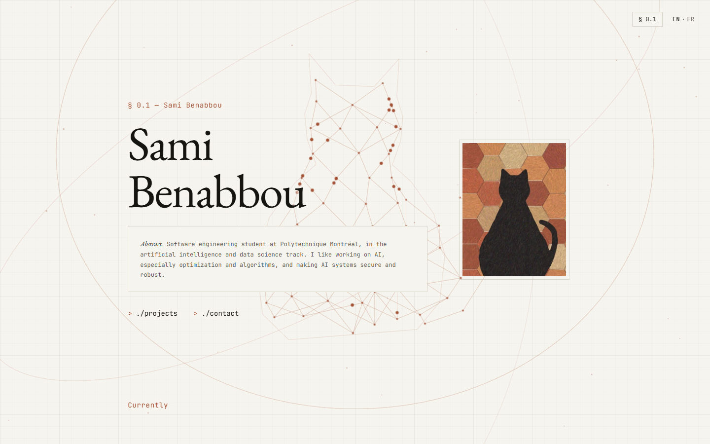

# aspectlight.github.io

Source of my personal website, **[aspectlight.github.io](https://aspectlight.github.io)**, in English and [French](https://aspectlight.github.io/fr/).

<picture>
  <source media="(prefers-color-scheme: dark)" srcset=".github/assets/hero-dark.png">
  
</picture>

## Worth a look

- **A cat you can reconstruct.** The background is my avatar's cat drawn as a neural network in Three.js, with signals climbing from the paws to the ears. Click any empty space and the site answers a proximity query: a line snaps to the nearest point of the cat's outline and that edge lights up. Enough queries reconstruct the silhouette, which is the problem my research internship studies, at toy scale. See [`background-3d/`](src/components/home/background-3d).
- **Bilingual without a reload.** Both languages share section ids, so switching swaps the text in place and keeps you at the same reading position.
- **Motion that steps aside.** Reveals and smooth scrolling turn off under `prefers-reduced-motion`, the 3D scene holds still, and nothing is hidden when JavaScript is off.
- **Checked, not hoped.** `pnpm run check` runs strict TypeScript, type-aware ESLint, Stylelint and Prettier, and fails on a single warning.

## Built with

[Astro](https://astro.build) 7 · TypeScript · [Three.js](https://threejs.org) · [Lenis](https://lenis.darkroom.engineering) · plain CSS with design tokens · GitHub Pages

## Running locally

Needs [pnpm](https://pnpm.io), which fetches the pinned Node version by itself.

```sh
pnpm install
pnpm dev          # http://localhost:4321
pnpm run check    # types, lint, styles, formatting
pnpm build        # static site in dist/
```

## Project structure

```text
src/
├── pages/        routes: /, /fr/ and the 404 page
├── views/        one component per page
├── components/   home/ for page sections and the 3D background, ui/ for shared pieces
├── core/         enums, constants, types and small domain helpers
├── data/         the content: profile, projects, education
├── i18n/         English and French strings
└── styles/       design tokens and global CSS
```

Content lives in `src/data/` and `src/i18n/`, so editing a project or a sentence never touches a component.

## Deployment

Every push to `main` builds the site and publishes it to GitHub Pages through [`deploy.yml`](.github/workflows/deploy.yml).

## Credits

- Type set in [EB Garamond](https://fonts.google.com/specimen/EB+Garamond) and [JetBrains Mono](https://www.jetbrains.com/lp/mono/). Icons from [Bootstrap Icons](https://icons.getbootstrap.com) (MIT).

## License

Code is under the [MIT License](LICENSE). Text, the avatar illustration and other images are © Sami Benabbou, all rights reserved.
